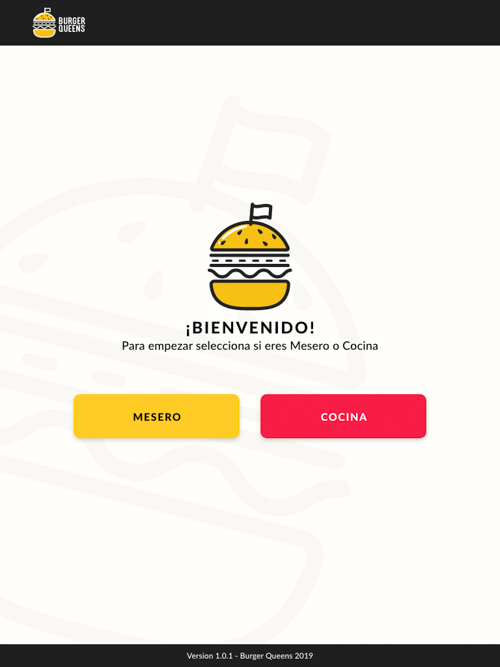
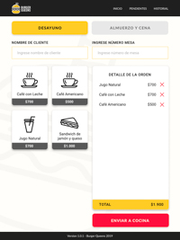
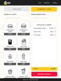
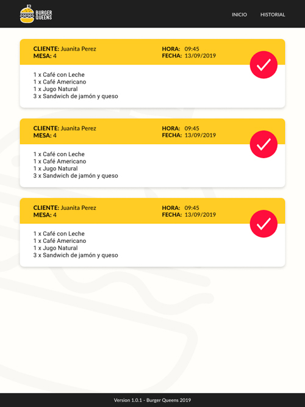
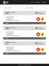
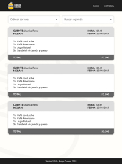

# Burger Queens

  Burger Queens es una interfaz para restaurantes que consiste en poder tomar pedidos de una manera fácil y expedita, desde cualquier tablet.

### Modo de uso 📔

En primer lugar el usuario deber **seleccionar  mesero o cocina** según en el área del restaurante que trabaje, desde cualquier de las dos vistas podrá acceder a un navegador de fácil uso.

Nuestra interface cuenta de 4 rutas de fácil acceso en el navegador: inicio, menu, pendientes e historial, los cuáles se posición en la parte superior derecho de la tablet.

**Si el usuario es mesero del restaurant**, tendrá acceso inmediato al menú, que consiste en la primera vista a los desayunos, y en la parte superior, con opciones de almuerzos. En esta vista, se debe ingresa el nombre del usuario en la parte superior y luego, seleccionar los productos del cliente, este se irá sumando a una comanda que **se enviará a cocina, haciendo click en el botón inferior "Enviar a cocina".**

**Si es cocinero** la interfaz enviará al usuario a la ruta de "pendientes" dónde podrá ver todo los pedidos enviados desde el mesero, que esperan a hacer cocinados. **Las comandas tienen dos botones, entregar y cancelar.**

En la ruta de historial, se podrá acceder a todo el historial de comandas del restaurant con el nombre de cliente, productos, total, fecha, hora y tiempo de espera desde que se envía la comanda del mesero hasta cuándo el cocinero selecciona el botón de **entregar.**

## Diagrama de flujo 📝

## Prototipo de alta fidelidad 💻

  

## Desarrolladoras 💻
*Fernanda Vega
Dharma
Daniela Quintana Martínez*
